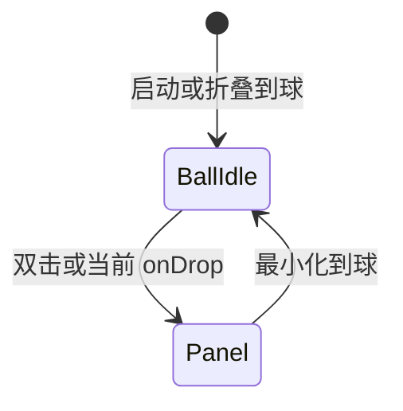

# 悬浮球「胶囊化与临场感」计划

借鉴 Dynamic Dock 的 morphing、磁吸与吞咽反馈，在现有 Electron 悬浮球上升级为 **桌面常驻的 AI 收件口**。  
本文档为 **第一版计划**（定效果与路线）；代码实现见文末 P0/P1/P2。

*文档版本：2026-06 · 仅前端 + Electron 窗口，不改后端 parse API*

---

## 1. 功能效果

> 本节描述用户「能看到、能感觉到」的行为，供答辩演示与评审对齐预期。

### 1.1 平时（Idle）

贴边时，悬浮球以 **半颗小圆** 的形式藏在屏幕边缘（沿用现有 peek 逻辑），露出约一条弧线。  
球体为 **半透明磨砂玻璃**：能隐约透出桌面壁纸，带一圈极细高光描边，中心保留微弱的 AI 星光图标。  
整体透明度约 85%，不抢焦点，像系统级小挂件而非第二个应用窗口。

**用户感受：**「它一直在那儿，但不碍事；需要时我知道往哪拖文件。」

### 1.2 靠近（Approach）

用户在资源管理器中 **拖起文件** 向球移动。当光标与球心距离约 **50px** 时（P1 目标），球像被磁铁吸住：沿拖入方向 **轻微拉长**，圆角增大，在约 150ms 内 **变形为胶囊**。  
胶囊比 idle 圆 **大一圈**，仍保持贴边锚点，不会突然跳到屏幕中央。  
（P0 务实版：指针 **进入** 悬浮窗命中区时开始变形，同时主进程将窗口扩为胶囊尺寸，扩大可投放区域。）

**用户感受：**「文件还没松手，它就『张开嘴』准备接了。」

### 1.3 悬停靶心（Armed）

变形完成后，胶囊内部出现 **接收靶心**：例如虚线椭圆环、向内脉冲的光晕，或极简文案「松手投放」。  
系统拖放光标为 `copy`；胶囊边缘亮度略增，暗示「可以松手」。  
此状态保持到 **drop** 或 **拖离取消**。

**用户感受：**「瞄准很容易，不用对准 44px 的小圆点。」

### 1.4 吞咽（Swallow）

用户松手的瞬间，胶囊 **向内收缩**（scale 约 0.92 → 1.0，spring 回弹），像吞下一口文件。  
**不弹出** 全屏主面板，不打断当前桌面工作流（非模态）。

**用户感受：**「接住了，但没有被拽进一个大窗口。」

### 1.5 处理中（Processing）

胶囊 **维持** 在 Armed 尺寸；内部显示 **极细进度条**（底部 2px）或 **缓慢旋转的细光环**，表示正在 `POST /parse`。  
用户可继续操作其他窗口；解析在后台进行。多文件时按队列推进（P1）。

**用户感受：**「它在帮我干活，我不用盯着等。」

### 1.6 完成（Done）

解析成功后，胶囊表面 **闪过一丝蓝紫色光晕**（与现有品牌渐变一致），持续约 300ms。  
可选：角标或极轻 toast「已加入 N 个文件」（不抢焦点）。  
随后胶囊 **优雅缩回** idle 小圆球，贴边 peek 恢复。

**用户感受：**「搞定了，反馈很轻但很确定。」

### 1.7 恢复（Rest）

回到 Idle 形态；贴边隐藏、拖动、双击展开主面板等行为与现版一致。  
深度操作（改标签、看建议原因、确认改名）仍通过 **双击球 → 主面板** 完成。

**用户感受：**「平时是收件口，要细看再打开面板。」

### 1.8 非模态 UX 原则

| 原则 | 说明 |
|------|------|
| 拖入 ≠ 开面板 | 投放文件后默认 **不** 调用 `expandToPanel()` |
| 主面板 = 深度编辑 | 列表、详情、设置、导出仍在 `GlassShell` |
| 球 = 轻量入口 | 收文件 + 短反馈；减少「第二个文件管理器」的心理负担 |
| 可预测 | 取消拖放（拖离）必须能回到 Idle，不能卡在胶囊 |

---

## 2. 设计参考与目标定位

- **参考对象**：Dynamic Dock — 形态衍生（Morphing）、磁吸、吞咽式反馈、非模态常驻。
- **产品定位**：HCI 答辩亮点 — **「桌面上的 AI 文件收件口」**，强化已实现的悬浮球差异化。
- **技术边界**：不修改后端；第一版仅 **渲染进程 UI/动效 + Electron 主进程窗口尺寸 IPC**。
- **与现有能力关系**：在 [`BallShell.tsx`](../src/components/BallShell.tsx)、[`electron/main.ts`](../electron/main.ts) 上迭代，保留透明窗、贴边、失焦方框等已修复行为。

---

## 3. 现状基线



| 能力 | 现状 | 胶囊化需要 |
|------|------|------------|
| 窗口尺寸 | 固定 `BALL_SIZE=56`（[`main.ts`](../electron/main.ts)） | 动态胶囊尺寸（如 112×64） |
| 形态 | `#root` 圆形 `clip-path`（[`index.css`](../src/index.css)） | 胶囊圆角 + morph 动画 |
| 视觉 | `.ball-core` 实心渐变圆 | 半透明毛玻璃 + 降级方案 |
| 拖入 | `onDrop` → `expandToPanel()` | 吞咽 + 留在球内反馈 |
| 解析状态 | [`useFileStore`](../src/hooks/useFileStore.ts) `parsing` / `processed` | 绑定到球 UI 进度/闪光 |
| 贴边 | `ballBoundsPeek` / `Expanded` | 胶囊态 peek 宽高重算 |

---

## 4. 形态状态机与动效规格

```
idle → approach → armed → swallow → processing → success → idle
              ↘ cancel（拖离）→ idle
```

| 状态 | 主进程窗口 | 视觉（framer-motion / CSS） | 建议时长 |
|------|------------|-----------------------------|----------|
| `idle` | 56×56 圆 | 半透明玻璃圆，opacity ~0.85 | — |
| `approach` | 开始向胶囊插值 | scaleX 1.0→1.35，圆角 50%→胶囊 | 120–180ms |
| `armed` | 胶囊目标宽高 | 靶心环 / 「松手投放」 | 至 drop 或 leave |
| `swallow` | 保持胶囊 | scale 0.92→1.0 spring | ~200ms |
| `processing` | 保持胶囊 | 2px 进度条或 SVG 环 | 至 parse 结束 |
| `success` | 保持胶囊 | 蓝紫 flash overlay | ~300ms |
| `idle` | 缩回 56×56 | morph 反向 | ~250ms |

### 50px 磁吸（两档）

| 档位 | 行为 | 阶段 |
|------|------|------|
| **理想** | 拖文件时，距球心 &lt;50px 即 approach（扩大命中区或主进程监测光标） | P1 |
| **务实** | `dragenter` 时扩窗为胶囊 + 播放 approach（命中区随形态变大） | P0 |

`prefers-reduced-motion: reduce`：跳过 morph，直接切换 idle ↔ 胶囊。

---

## 5. 技术方案与平台约束

### 5.1 主进程 [`electron/main.ts`](../electron/main.ts)

- 新增 `BALL_CAPSULE = { width: 112, height: 64 }`（可调）、`ballVisualState`。
- 新 IPC：`ball:setVisualState('idle' | 'capsule')` 或 `ball:setBoundsPreset('capsule')`；按 `ballEdge` 重算 x/y，避免扩窗出屏。
- 胶囊态每次 `setBounds` 后仍调用 `refreshBallWindowChrome()`，避免失焦方框回归。

### 5.2 渲染进程

- 重构 [`BallShell.tsx`](../src/components/BallShell.tsx)：状态机 + 子组件 `BallMorphSurface`。
- 使用 **framer-motion** 驱动 `layout`、`borderRadius`、`scale`。
- 新增 `useBallParseFeedback`：监听本次 drop 的 `parsing` → `processed` → `success`。
- **P0**：移除 `onDrop` 内默认 `expandToPanel()`；双击仍可展开。

### 5.3 样式 [`index.css`](../src/index.css)

- `#root`：按状态切换 `.ball-root--idle` / `.ball-root--capsule`（`clip-path` 或动态 `border-radius`）。
- `.ball-glass`：`rgba` 底 + `backdrop-filter: blur(12px)`；Win 透明窗无效时降级半透明纯色 + 细噪点。

### 5.4 风险与缓解

| 风险 | 缓解 |
|------|------|
| 50px 区外收不到 drag 事件 | P0：`dragenter` 扩窗；P1：透明 hit-slop 层 |
| 胶囊 + 贴边 peek 错位 | 扩窗按 `ballEdge` / `ballAnchor` 重算 |
| `backdrop-filter` 在透明 Electron 窗失效 | 降级样式，答辩说明平台差异 |
| 与失焦方框修复冲突 | 保持 `backgroundMaterial: 'none'` + blur/focus 刷新 |

---

## 6. 分阶段路线图

### P0 — 可演示最小闭环（建议首版开发）

- [x] 本计划文档定稿
- [x] `dragenter` → 胶囊 morph + 主进程扩窗
- [x] `drop` → 吞咽动画，**不自动展开主面板**
- [x] 单文件 parsing：胶囊内 indeterminate 进度
- [x] `processed` → 蓝紫闪光滑回 idle

### P1 — 临场感加强

- [ ] 50px 磁吸（扩大透明命中层 / 光标距离）
- [ ] 多文件队列进度
- [ ] 贴边态胶囊 peek 适配

### P2 — 顶级打磨

- [ ] 可选微音效
- [ ] 设置项「简洁球 / 胶囊动效」
- [ ] 与列表 `justCompleted` 角标联动

---

## 7. 验收标准与答辩演示脚本

1. 资源管理器拖文件至贴边球 → 胶囊展开 → 松手 → 吞咽 → 进度环 → 闪光滑回；**主面板未自动弹出**。
2. **双击** 球仍可进入主面板查看列表与详情。
3. 拖文件中途拖离 → 胶囊缩回 idle，无卡死。
4. 系统「减少动态效果」下形态瞬间切换，功能可用。
5. Win10 / Win11：无毛玻璃时形态仍清晰；失焦无方形衬底回归。

**演示口播（约 30 秒）：**  
「平时它是贴边小圆球；拖文件过来，它会长成胶囊靶心；松手吞进去，在球里转一圈表示 AI 在解析，闪一下光就缩回去——全程不用打开大面板，桌面工作流不中断。」

---

## 相关代码入口

| 路径 | 职责 |
|------|------|
| `src/components/BallShell.tsx` | 悬浮球交互（待状态机化） |
| `src/index.css` | ball / electron-ball-mode 样式 |
| `electron/main.ts` | `BALL_SIZE`、贴边、窗口透明 |
| `src/hooks/useFileStore.ts` | 解析状态机 |
| `src/App.tsx` | `shellMode` ball / panel 切换 |
