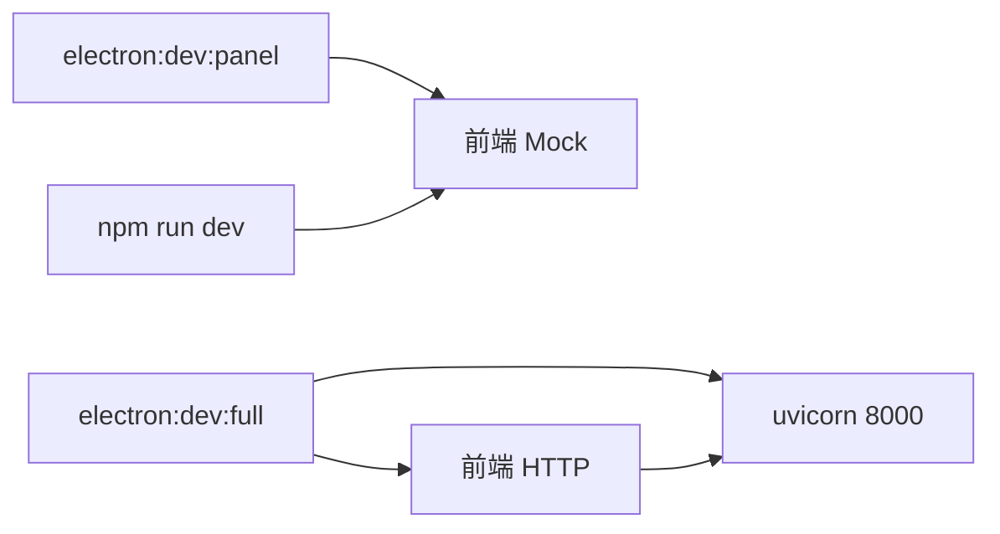

# AI Dropzone — 进度与计划

团队内「当前做到哪、怎么跑、接下来做什么」的单一说明。  
详细安装步骤与排错见仓库根目录 [SETUP.md](../../SETUP.md)；npm 命令明细见 [frontend/README.md](../README.md)。

*文档版本：2026-05 · 与仓库代码同步维护*

---

## 1. 当前进度（已实现）

### 前端 UI

- [x] 三阶段状态机：空态大 Dropzone → 列表 → 左列表 + 右详情
- [x] 毛玻璃外壳（`GlassShell`）、底栏：日志 / 导出 / 设置
- [x] 拖放：`react-dropzone` + Electron 专用 `dropzoneGetFilesFromEvent`（同步解析磁盘路径）
- [x] Mock / HTTP 双模式：`useFileStore` + `services/dropzoneApi.ts`

### Electron 桌面

- [x] 悬浮球 ↔ 主面板切换（`shellMode: ball | panel`）
- [x] 悬浮球：透明方窗 + 圆形 UI；桌面任意位置可放；**靠近屏幕边缘**时贴边缩入（peek）
- [x] 双击或拖入文件可展开主面板
- [x] 主进程 IPC：`moveBallTo`、`finishBallDrag`、`expandToPanel` 等（见 `electron/main.ts`）

### 后端联调（`electron:dev:full`）

- [x] `POST /parse`、`/rename`、`GET /journal`、`POST /undo`、`POST /export`
- [x] `GET/PUT /config`；解析引擎 `mock` | `llm`（DeepSeek，见 `backend/modules/llm_parser.py`）
- [x] 设置页填写 DeepSeek API Key → 写入 `backend/config.json`（读取时脱敏）

---

## 2. 环境配置

### 2.1 三种常用启动方式

| 命令 | Mock | 需要 uvicorn | 典型用途 |
|------|:----:|:------------:|----------|
| `npm run electron:dev:panel` | 是 | 否 | 答辩录屏、只看 UI |
| **`npm run electron:dev:full`** | 否 | **是** | **真改名 / 导出 / DeepSeek** |
| `npm run electron:dev` | 是 | 否 | 默认从悬浮球启动 |
| `npm run dev` | 是 | 否 | 仅浏览器，拿不到真实磁盘路径 |

关系概览：



### 2.2 环境变量文件

| 文件 | 是否提交 Git | 作用 |
|------|:------------:|------|
| `.env.example` | 是 | Mock 模板 |
| `.env.local` | 否（自建） | 覆盖 Mock / 手动联调 |
| `.env.full` | 是 | `electron:dev:full` 自动加载 |

| 变量 | 完整桌面（`.env.full`） |
|------|-------------------------|
| `VITE_USE_MOCK` | `false` |
| `VITE_API_BASE` | `http://127.0.0.1:8000`（须与 uvicorn 端口一致） |

### 2.3 完整功能：双终端启动（推荐）

**终端 1 — 仓库根目录（保持运行）：**

```powershell
cd D:\HCI_teamwork\HCI_Course_Design-AIDropzone
# 可选：python -m venv venv  &&  venv\Scripts\activate
pip install -r requirements.txt
uvicorn backend.main:app --reload --host 127.0.0.1 --port 8000
```

**终端 2 — `frontend/`：**

```powershell
cd D:\HCI_teamwork\HCI_Course_Design-AIDropzone\frontend
npm install
npm run electron:dev:full
```

若 8000 端口被占用，可改用 8765，并同步修改 `frontend/.env.full` 中的 `VITE_API_BASE`。

### 2.4 DeepSeek API Key（勿与本地后端混填）

| 配置项 | 填什么 |
|--------|--------|
| **本地后端地址**（设置里） | `http://127.0.0.1:8000`（本机 uvicorn） |
| **DeepSeek API Key**（设置里单独一栏） | 你在 [platform.deepseek.com](https://platform.deepseek.com) 申请的 `sk-…` |
| **AI 解析引擎** | 选「DeepSeek 大模型」，后端 `ai_parser` 为 `llm` |

**不要**把 `https://api.deepseek.com` 填进「本地后端地址」，否则会 HTTP 404。

保存流程：关闭 Mock → 启动 uvicorn → 设置里填 Key → **保存设置**（写入 `backend/config.json`）。

### 2.5 首次环境（只做一次）

```powershell
cd D:\HCI_teamwork\HCI_Course_Design-AIDropzone\frontend
npm install
npm run env:doctor          # 检查 Node / Electron / tsc
# 若 Electron 损坏：npm run env:bootstrap
```

修改 `electron/` 后需执行：`npm run build:electron`，再启动 Electron。

---

## 3. 未来计划

### 3.1 产品方向（v2 · 方向 C + C2）

当前实现以 **v1 路径** 为主：拖入真实路径 → 解析/改名 → 导出扫描 `workspace` 等。  
v2 目标：**整理篮（C2）** + **按会话路径列表导出（C）**，让用户心理模型与导出行为一致。

| 优先级 | 内容 |
|--------|------|
| **P0** | 导出按会话 `file_paths[]`；扩展 `API_CONTRACT` |
| **P1** | 拖入复制到整理篮；与 `config.json` 的 `workspace_root` 对齐 |
| **P1** | 导出后可选删除源文件（默认不勾选 + 二次确认） |
| **P2** | UI 标签与文件名解耦；答辩/HCI 文档整理 |

**v1 → v2 一句话**：v1 常靠「workspace 内文件名 + 标签 token」做导出；v2 改为「会话里登记的路径列表」打包，避免「桌面改好的文件打不进 zip」。

### 3.2 答辩叙事可强调

1. 多渠道零散文件 → 单一拖放入口  
2. v1 教训：隐藏 workspace 与文件名当数据库 → 用户困惑  
3. v2：可见整理篮 + 按路径导出 + 可选打包后清理（HCI：可见性、防错、用户控制）

---

## 4. 相关文档

| 文档 | 用途 |
|------|------|
| [SETUP.md](../../SETUP.md) | 环境安装、端口、常见问题 |
| [frontend/README.md](../README.md) | npm 脚本、模式说明 |
| [backend/API_CONTRACT.md](../../backend/API_CONTRACT.md) | 接口 JSON |
| [backend/ARCHITECTURE.md](../../backend/ARCHITECTURE.md) | 回滚、解析架构 |

---

## 5. 代码入口速查

| 路径 | 职责 |
|------|------|
| `src/App.tsx` | 布局、shellMode、视图路由 |
| `src/hooks/useFileStore.ts` | 文件列表、拖入、解析 |
| `src/components/BallShell.tsx` | 悬浮球交互 |
| `src/components/GlassShell.tsx` | 主面板外壳 |
| `src/views/SettingsView.tsx` | Mock / API / DeepSeek 设置 |
| `src/services/dropzoneApi.ts` | API 封装与 Mock 开关 |
| `electron/main.ts` | 窗口、贴边、IPC |
